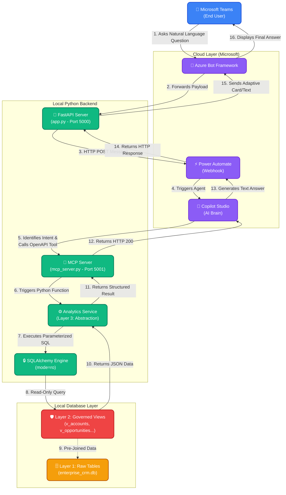

# AI SQL Analytics Agent Architecture

This diagram illustrates the complete, end-to-end architecture of your enterprise-grade AI SQL Analytics Agent. It highlights the flow of data from the end-user in Microsoft Teams, through the AI and API layers, down to the governed SQL views we implemented.

## Key Architectural Highlights

1. **Perfect Abstraction (Layer 3)**: Copilot Studio never writes raw SQL. It simply calls predefined OpenAPI endpoints (e.g., `/api/tools/top_accounts`), passing safe parameters like `industry="Healthcare"`.
2. **Strict Data Governance (Layer 2)**: The Python code only queries explicitly allowed SQL Views (e.g., `v_opportunities_enriched`), completely isolating the AI from your raw production tables.
3. **Physical Security Lock**: Even if an unauthorized query was somehow injected, the SQLAlchemy Engine is physically locked in Read-Only mode (`?mode=ro`). The database will aggressively reject any modification attempts.
